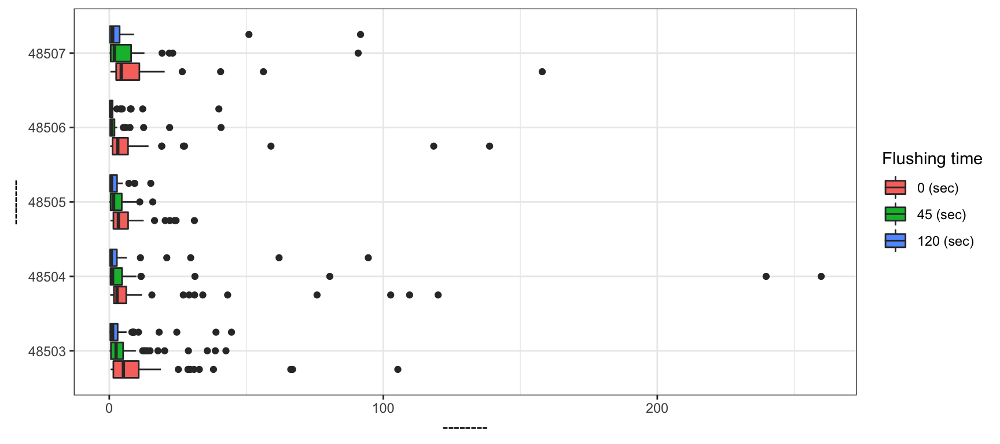
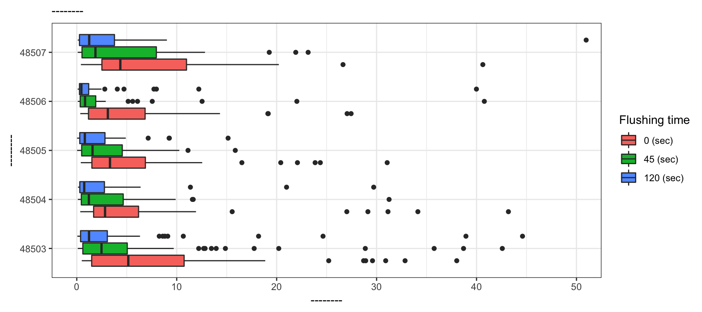

## Concepts introduced

- Knitting documents
- R Markdown and (some) R syntax

## Introduction

The data set consists homes sampled with three water lead contaminant values at designated time points. The lead content is in parts per billion (ppb). Additionally, some location data is given about each home.

To get started, read in the `flint.csv` file using the function `read_csv`.


```r
library(tidyverse)
```


```r
flint <- read_csv("data/flint.csv")
```

In this file, there are five variables:

- **id**: sample ID number (identifies the home)
- **zip**: ZIP code in Flint of the sample's location
- **ward**: ward in Flint of the sample's location
- **draw**: which time point the water was sampled from
- **lead**: lead content in parts per billion

Let's preview the data with the `glimpse()` function:


```r
glimpse(flint)
```

```
## Rows: 813
## Columns: 5
## $ id   <dbl> 1, 2, 4, 5, 6, 7, 8, 9, 12, 13, 15, 16, 17, 18, 19, 20, 21, 22, …
## $ zip  <dbl> 48504, 48507, 48504, 48507, 48505, 48507, 48507, 48503, 48507, 4…
## $ ward <dbl> 6, 9, 1, 8, 3, 9, 9, 5, 9, 3, 9, 5, 2, 7, 9, 9, 5, 6, 2, 6, 1, 5…
## $ lead <dbl> 0.344, 8.133, 1.111, 8.007, 1.951, 7.200, 40.630, 1.100, 10.600,…
## $ draw <chr> "first", "first", "first", "first", "first", "first", "first", "…
```

There are ______ samples in the data set. 

## Analysis

### Part 1

Let's see how many homes are in the data set. 


```r
flint %>%
  count(id)
```

```
## # A tibble: 269 x 2
##       id     n
##    <dbl> <int>
##  1     1     3
##  2     2     3
##  3     4     3
##  4     5     3
##  5     6     3
##  6     7     3
##  7     8     3
##  8     9     3
##  9    12     3
## 10    13     3
## # … with 259 more rows
```

Fill in the code to see how many samples samples were taken from each zip code. Uncomment the lines (i.e. remove the `#` before running the code)


```r
# flint %>% 
 # count(______)
```

Which ZIP code had the most samples drawn?

### Part 2

Next, let's look at the mean and median lead contaminant values for each zip code and draw combination. We have eight zip codes and samples taken at three times. How many combinations do we have?


```r
flint %>% 
  group_by(zip, draw) %>% 
  summarise(mean_pb = mean(lead))
```

```
## `summarise()` regrouping output by 'zip' (override with `.groups` argument)
```

```
## # A tibble: 24 x 3
## # Groups:   zip [8]
##      zip draw   mean_pb
##    <dbl> <chr>    <dbl>
##  1 48502 first     2.27
##  2 48502 second    2.81
##  3 48502 third     3.05
##  4 48503 first    11.0 
##  5 48503 second    5.66
##  6 48503 third     3.77
##  7 48504 first    13.2 
##  8 48504 second   32.6 
##  9 48504 third     5.13
## 10 48505 first     6.09
## # … with 14 more rows
```


```r
flint %>% 
  group_by(zip, draw) %>% 
  summarise(median_pb = median(lead))
```

```
## `summarise()` regrouping output by 'zip' (override with `.groups` argument)
```

```
## # A tibble: 24 x 3
## # Groups:   zip [8]
##      zip draw   median_pb
##    <dbl> <chr>      <dbl>
##  1 48502 first      2.27 
##  2 48502 second     2.81 
##  3 48502 third      3.05 
##  4 48503 first      5.15 
##  5 48503 second     2.47 
##  6 48503 third      1.23 
##  7 48504 first      2.83 
##  8 48504 second     1.22 
##  9 48504 third      0.744
## 10 48505 first      3.32 
## # … with 14 more rows
```

How many rows are in each of two above data frames?

### Part 3

Modify the code below to compute the mean and median lead contaminant values for zip code 48503 at the first draw. What should you put in for `draw == "_____"`? Don’t forget to uncomment the second line of code.


```r
flint %>% 
  # filter(zip == 48503, draw == "_____") %>% 
  summarise(mean_pb = mean(lead),
            median_pb = median(lead))
```

```
## # A tibble: 1 x 2
##   mean_pb median_pb
##     <dbl>     <dbl>
## 1    8.20      1.85
```

### Part 4

Let’s make some plots, where we will focus on zip codes 48503, 48504, 48505, 48506, and 48507. We will restrict our attention to samples with lead values less than 1,000 ppb.


```r
flint_focus <- flint %>% 
  filter(zip %in% 48503:48507, lead < 1000)
```

Below are side-by-side box plots for the three flushing times in each of the five zip codes we considered. Add `x` and `y` labels; add a title by inserting `title = "title_name"` inside the `labs()` function.


```r
ggplot(data = flint_focus, aes(x = factor(zip), y = lead)) +
  geom_boxplot(aes(fill = factor(draw))) +
  labs(x = "--------", y = "--------", fill = "Flushing time") +
  scale_fill_discrete(breaks = c("first", "second", "third"),
                      labels = c("0 (sec)", "45 (sec)", "120 (sec)")) +
  coord_flip() +
  theme_bw()
```



Add labels for `x`, `y`, a `title`, and `subtitle` to the code below to update the corresponding plot.


```r
ggplot(data = flint_focus, aes(x = factor(zip), y = lead)) +
  geom_boxplot(aes(fill = factor(draw))) + 
  labs(x = "--------", y = "--------", fill = "Flushing time",
       subtitle = "--------") +
  scale_fill_discrete(breaks = c("first", "second", "third"),
                      labels = c("0 (sec)", "45 (sec)", "120 (sec)")) +
  coord_flip(ylim = c(0, 50)) +
  theme_bw()
```



What is the difference between the two plots? What are the advantages and disadvantages to each plot? 

## Submitting application exercises 

**Once you have completed the activity, push your final changes to your GitHub repo! Make sure your repo is updated on GitHub, and that's all you need to do to submit application exercises for participation.**

## References

1. Langkjaer-Bain, R. (2017). The murky tale of Flint’s deceptive water data. Significance, 14: 16-21.
2. Holtz, Y. (2018). Pimp my RMD: a few tips for R Markdown. Accessed at [https://holtzy.github.io/Pimp-my-rmd/](https://holtzy.github.io/Pimp-my-rmd/)
