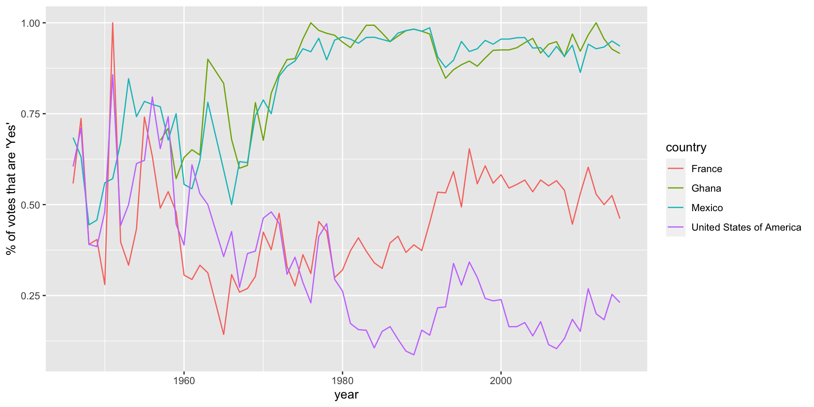
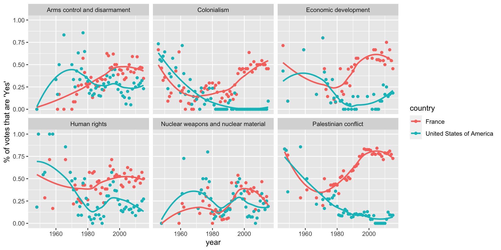

We want to look at the voting history of countries in the United Nations General 
Assembly using data from package `unvotes`. 


## Data

We will work with three data sets: `un_roll_calls`, `un_roll_call_issues`, 
and `un_votes`. Each data set contains a variable called `rcid`, the roll call 
id, which can be used to join the data sets with one another.

- The `un_votes` data set provides information on the voting history of the 
  United Nations General Assembly. It contains one row for each country/vote 
  pair.


```
## # A tibble: 738,764 x 4
##     rcid country                  country_code vote 
##    <int> <chr>                    <chr>        <fct>
##  1     3 United States of America US           yes  
##  2     3 Canada                   CA           no   
##  3     3 Cuba                     CU           yes  
##  4     3 Haiti                    HT           yes  
##  5     3 Dominican Republic       DO           yes  
##  6     3 Mexico                   MX           yes  
##  7     3 Guatemala                GT           yes  
##  8     3 Honduras                 HN           yes  
##  9     3 El Salvador              SV           yes  
## 10     3 Nicaragua                NI           yes  
## # … with 738,754 more rows
```

- The `un_roll_calls` data set contains information on each roll call vote of 
  the United Nations General Assembly.


```
## # A tibble: 5,429 x 9
##     rcid session importantvote date       unres  amend  para short   descr      
##    <int>   <dbl>         <dbl> <date>     <chr>  <dbl> <dbl> <chr>   <chr>      
##  1     3       1             0 1946-01-01 R/1/66     1     0 AMENDM… "TO ADOPT …
##  2     4       1             0 1946-01-02 R/1/79     0     0 SECURI… "TO ADOPT …
##  3     5       1             0 1946-01-04 R/1/98     0     0 VOTING… "TO ADOPT …
##  4     6       1             0 1946-01-04 R/1/1…     0     0 DECLAR… "TO ADOPT …
##  5     7       1             0 1946-01-02 R/1/2…     1     0 GENERA… "TO ADOPT …
##  6     8       1             0 1946-01-05 R/1/2…     1     0 ECOSOC… "TO ADOPT …
##  7     9       1             0 1946-02-05 R/1/3…     0     0 POST-W… "TO OPEN T…
##  8    10       1             0 1946-02-05 R/1/3…     1     1 U.N. M… "TO ADOPT …
##  9    11       1             0 1946-02-05 R/1/3…     0     0 TRUSTE… "TO ADOPT …
## 10    12       1             0 1946-02-06 R/1/3…     1     1 COUNCI… "TO ADOPT …
## # … with 5,419 more rows
```

- The `un_roll_call_issues` data set contains issue classifications of roll 
  call votes of the United Nations General Assembly. There are many votes that 
  have no issue classification, and some are classified under more than 
  one issue.


```
## # A tibble: 5,281 x 3
##     rcid short_name issue               
##    <int> <chr>      <chr>               
##  1  3372 me         Palestinian conflict
##  2  3658 me         Palestinian conflict
##  3  3692 me         Palestinian conflict
##  4  2901 me         Palestinian conflict
##  5  3020 me         Palestinian conflict
##  6  3217 me         Palestinian conflict
##  7  3298 me         Palestinian conflict
##  8  3429 me         Palestinian conflict
##  9  3558 me         Palestinian conflict
## 10  3625 me         Palestinian conflict
## # … with 5,271 more rows
```

## Analysis

### Part 1

We begin by looking at how often each country voted "yes" on a resolution in 
each year. We'll visualize the results, so let's pick a few countries of 
interest and focus our analysis on them.


```
## `summarise()` regrouping output by 'year' (override with `.groups` argument)
```



### Part 2

Next, let's see how the voting records have changed over the years on each of the issues.



### Discussion Questions

1. Consider the plot from Part 1. Describe how the voting behaviors of the four  countries have changed over time.

2. Consider the plot from Part 2. 
    - On which issues have the two countries voted most similarly in 
      recent years?  
    - On which issues have they voted most differently in recent years? 
    - Has this changed over time?


## References

1. David Robinson (2017). unvotes: United Nations General Assembly Voting Data. 
   R package version 0.2.0. https://CRAN.R-project.org/package=unvotes.
2. Erik Voeten "Data and Analyses of Voting in the UN General Assembly" 
   Routledge Handbook of International Organization, edited by Bob Reinalda 
   (published May 27, 2013).
3. This assignment was adapted from 
   [UN Votes](https://github.com/rstudio-education/datascience-box/tree/master/appex/ae-01-un-votes) 
   exercise and the examples presented in the 
   [unvotes package vignette](https://cran.r-project.org/web/packages/unvotes/vignettes/unvotes.html).


## Appendix

Below is a list of countries in the data set:

preserve644763dec65b452e
