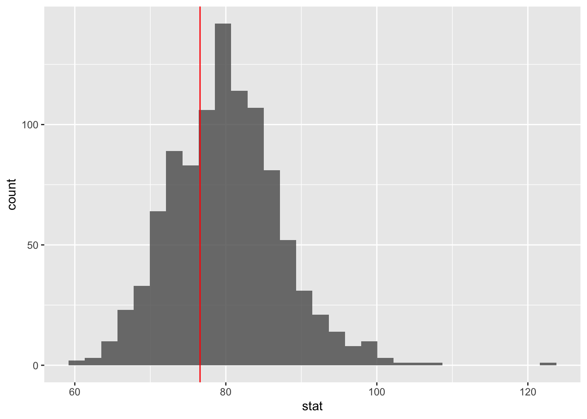
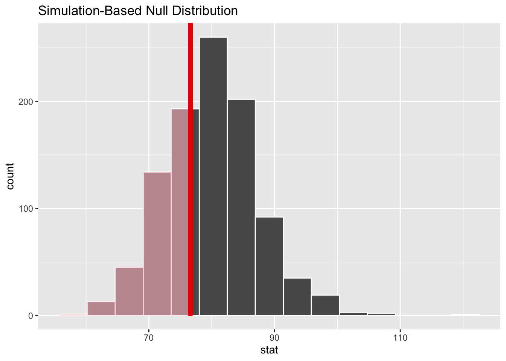

## Announcements 

- Lab 05 due today at 11:59p
- No lab this week
- Exam 01: Thu 9a - Sun 11:59p
  - Material from Weeks 01 - 04 (data viz, data wrangling, probablity)
  - Open book/ open note
  - You **cannot** discuss the exam with anyone
  - Piazza will be in active + no office hours during exam period
  - Email Prof. Tackett if you have questions. 
  - See [Academic honesty policy](https://sta199-fa20-002.netlify.app/syllabus/#course-community) in the course syllabus.
  - Will have an Exam 01 repo on GitHub. A link to the exam instructions will be in the README of the repo. Push your changes to the repo, then submit the final PDF on gradescope. Be sure to mark the pages corresponding to each question.
  

## Questions from video? 

## Resource for full examples in infer

https://infer.netlify.app/articles/observed_stat_examples.html

### From last class


```r
library(tidyverse)
library(infer)
```


```r
asheville <- read_csv("data/asheville.csv")
```

```
## Parsed with column specification:
## cols(
##   ppg = col_double()
## )
```

Suppose you are interested in whether the mean price per guest per night is actually less than $80. Conduct a hypothesis test to assess this claim.

**Hypotheses**

$H_0$: The mean price per guest per night is $80

$H_a$: The mean price per guest per night is less than $80

$H_0: \mu = 80$

$H_a: \mu < 80$

**Simulate null distribution**


```r
set.seed(092320)
```


```r
null_dist <- asheville %>%
  specify(response = ppg) %>%
  hypothesize(null = "point", mu = 80) %>%
  generate(reps = 1000, type = "bootstrap") %>%
  calculate(stat = "mean")
```


```r
mean_ppg <- asheville %>%
  summarise(mean_ppg = mean(ppg)) %>%
  pull()
```

**Visualize Null distribution using ggplot**


```r
ggplot(data = null_dist, aes(x = stat)) +
  geom_histogram(alpha = 0.8) + 
  geom_vline(xintercept = mean_ppg, color = "red")
```



**Visualize null distribution using infer**


```r
visualize(null_dist) +
  shade_p_value(obs_stat = mean_ppg, direction = "less")
```



**Calculate p-value**


```r
null_dist %>%
  filter(stat <= mean_ppg) %>%
  summarise(p_value = n() / nrow(null_dist))
```

```
## # A tibble: 1 x 1
##   p_value
##     <dbl>
## 1   0.316
```

**Conclusion**

The p-value 0.312 is greater than $\alpha = 0.05$, so we fail to reject the null hypothesis. The data do not provide sufficient evidence that the mean price per night is less than $80. 


## Clone a repo + start a new project

Clone the **ae-12** repo on [GitHub](https://www.github.com/sta199-fa20-002) and start a new project in RStudio. Be sure to configure git in the RStudio console, so you can so you can push your results back up to GitHub.

### Exercise 1

Suppose you are interested in whether at least half of the Airbnb listings in Asheville are more than $50 per guest per night. What would be your null and alternative hypotheses?

### Exercise 2

Simulate the null distribution to test your hypotheses. You can use 100 reps for the in-class exercise.


```r
#simulate null dist
```

### Exercise 3

What was your p-value? What decision do you make with respect to your 
hypotheses, and what conclusion do you make in the context of the research
problem?


```r
# calc p-value
```


### Exercise 4

Suppose you are interested in whether the proportion of listings with a price per guest per night greater than $50 is 0.5. How would your null and 
alternative hypotheses change in this case? Carry out the appropriate
hypothesis test, and report your p-value, decision, and conclusion in context of the research problem. 

