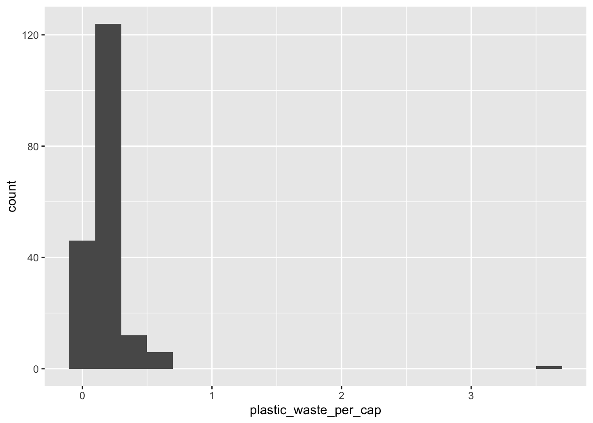
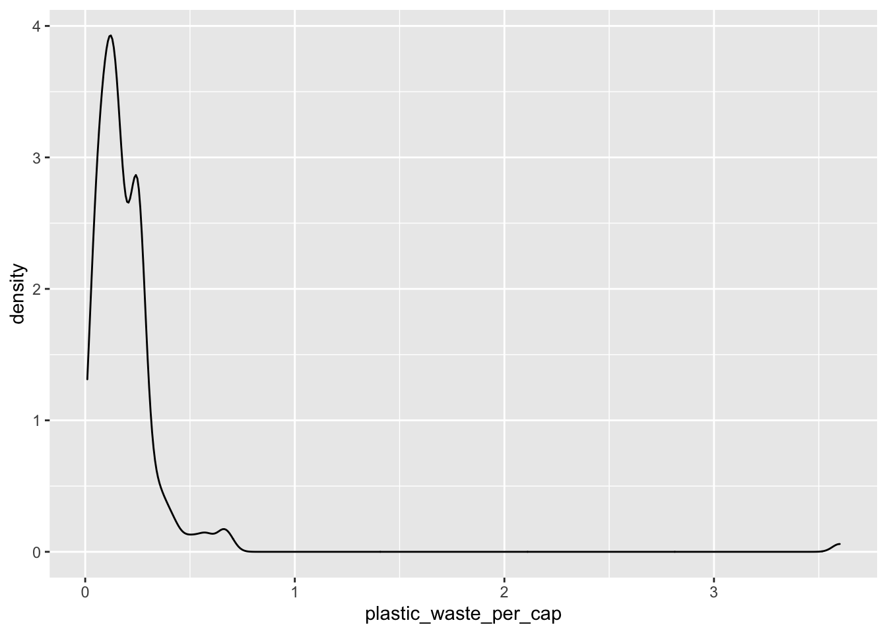
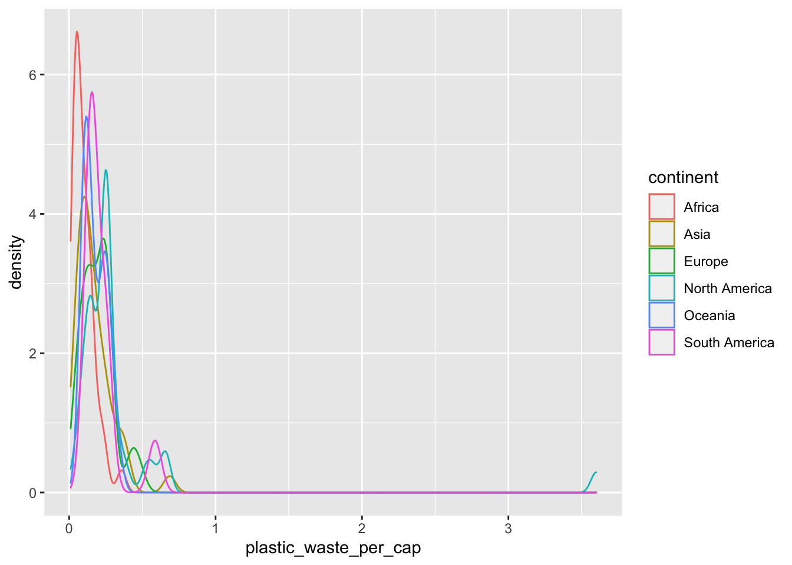
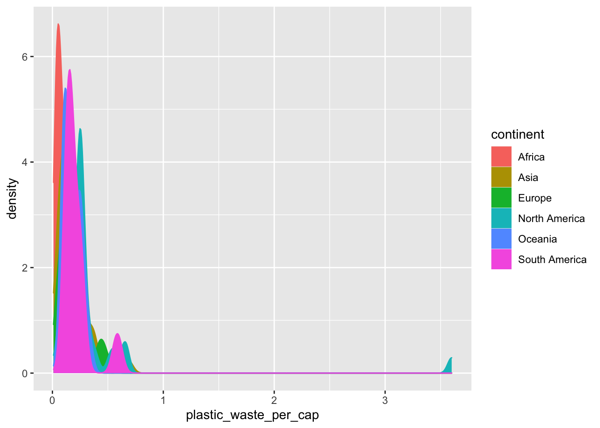
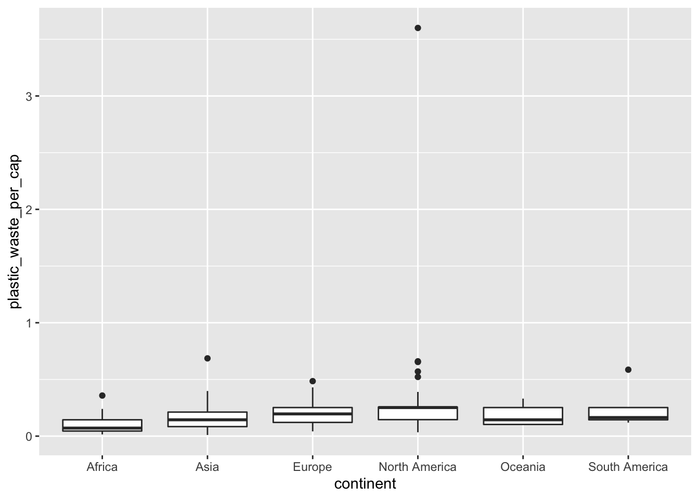

<label for="tufte-mn-" class="margin-toggle">&#8853;</label><input type="checkbox" id="tufte-mn-" class="margin-toggle"><span class="marginnote"><span style="display: block;"><strong>A note on expectations: </strong> For each exercise your answer include any relevant output (tables, summary statistics, plots) in your answer. Doing this is easy! Just place any relevant R code in a code chunk, and hit Knit HTML.</span></span>

Plastic pollution is a major and growing problem, negatively affecting oceans and wildlife health. [Our World in Data](https://ourworldindata.org/plastic-pollution) has a lot of great data at various levels including globally, per country, and over time. For this lab we focus on data from 2010.

Additionally, National Geographic recently ran a data visualization communication contest on plastic waste as seen [here](https://www.nationalgeographic.org/funding-opportunities/innovation-challenges/plastic/dataviz/).

Learning goals for this lab are

- Visualizing numerical and categorical data.
- Recreating  visualizations.
- Getting more practice using with Git and GitHub.

# Getting started

<label for="tufte-mn-" class="margin-toggle">&#8853;</label><input type="checkbox" id="tufte-mn-" class="margin-toggle"><span class="marginnote"><span style="display: block;"><strong>IMPORTANT:</strong> If there is no GitHub repo created for you for this assignment, it means I didn’t have your GitHub username as of when I assigned the homework. Please let me know your GitHub username asap, and I can create your repo.</span></span>

Go to the course GitHub organization and locate your Lab 02 repo, which should be named `lab-02-plastic-waste-[GITHUB USERNAME]`. Grab the URL of the repo, and clone it in RStudio. Refer to Lab 01 for step-by-step for cloning a repo and creating a new RStudio project.


## Configure git

<label for="tufte-mn-" class="margin-toggle">&#8853;</label><input type="checkbox" id="tufte-mn-" class="margin-toggle"><span class="marginnote"><span style="display: block;">The name should be your github username and your email address is the one tied to your GitHub account.</span></span>

Before we can get started we need to do one more thing.  Specifically,  we need to configure your git so that RStudio can communicate with GitHub. This requires two pieces of information: your email address and your GitHub username.

To do so, run the following:


```r
usethis::use_git_config(user.name = "github username", user.email = "your email")
```

## Update the name and date

You will write your answers in the document `lab-02-plastic-waste.Rmd` Before starting the exercises, be sure to update the author name and date in the YAML at the top of the .Rmd file. Knit the document and make sure the resulting PDF file has your name and date. 

# Packages

We'll use the **tidyverse** package for this analysis. You can run run the following code in the **Console** to load this package.


```r
library(tidyverse)
```


# The data

The dataset for this assignment can be found as a csv file in the `data` folder of your repository. You can read it in using the following line of code.


```r
plastic_waste <- read_csv("data/plastic-waste.csv")
```

The variable descriptions are as follows:

- `code`: 3 Letter country code
- `entity`: Country name
- `continent`: Continent name
- `year`: Year
- `gdp_per_cap`: GDP per capita constant 2011 international $, rate
- `plastic_waste_per_cap`: Amount of plastic waste per capita in kg/day
- `mismanaged_plastic_waste_per_cap`: Amount of mismanaged plastic waste per capita in kg/day
- `mismanaged_plastic_waste`: Tonnes of mismanaged plastic waste
- `coastal_pop`: Number of individuals living on/near coast
- `total_pop`: Total population according to Gapminder

# Exercises

Let's start by taking a look at the distribution of plastic waste per capita in 2010.


```r
ggplot(data = plastic_waste, aes(x = plastic_waste_per_cap)) +
  geom_histogram(binwidth = 0.2)
```



One country stands out as an unusual observation at the top of the distribution. One way of identifying this country is to filter the data for countries where plastic waste per capita is greater than 3.5 kg/person. *Note: We will talk about the `filter` function in class soon!*


```r
plastic_waste %>%
  filter(plastic_waste_per_cap > 3.5)
```

```
## # A tibble: 1 x 10
##   code  entity continent  year gdp_per_cap plastic_waste_p… mismanaged_plas…
##   <chr> <chr>  <chr>     <dbl>       <dbl>            <dbl>            <dbl>
## 1 TTO   Trini… North Am…  2010      31261.              3.6             0.19
## # … with 3 more variables: mismanaged_plastic_waste <dbl>, coastal_pop <dbl>,
## #   total_pop <dbl>
```

Did you expect this result? You might consider doing some research on Trinidad and Tobago to see why plastic waste per capita is so high there, or whether this is a data error.

1. Plot, using histograms, the distribution of plastic waste per capita faceted by continent. What can you say about how the continents compare to each other in terms of their plastic waste per capita?

<label for="tufte-mn-" class="margin-toggle">&#8853;</label><input type="checkbox" id="tufte-mn-" class="margin-toggle"><span class="marginnote"><span style="display: block;">From this point onwards the plots / output of the code won’t be printed in the lab, but you can run the code and view the results yourself.</span></span>

Another way of visualizing numerical data is using density plots.


```r
ggplot(data = plastic_waste, aes(x = plastic_waste_per_cap)) +
  geom_density()
```



And compare distributions across continents by coloring density curves by continent.


```r
ggplot(data = plastic_waste, 
       mapping = aes(x = plastic_waste_per_cap, 
                     color = continent)) +
  geom_density()
```



The resulting plot may be a little difficult to read, so let's also fill the curves in with colors as well.


```r
ggplot(data = plastic_waste, 
       mapping = aes(x = plastic_waste_per_cap, 
                     color = continent, 
                     fill = continent)) +
  geom_density()
```



The overlapping colors make it difficult to tell what's happening with the distributions in continents plotted first, and hence covered by continents plotted over them. We can change the transparency level of the fill color to help with this. The `alpha` argument takes values between 0 and 1: 0 is completely transparent and 1 is completely opaque. There is no way to tell what value will work best, so it's best to try a few. 


```r
ggplot(data = plastic_waste, 
       mapping = aes(x = plastic_waste_per_cap, 
                     color = continent, 
                     fill = continent)) +
  geom_density(alpha = 0.7)
```


This still doesn't look great...

1. Recreate the density plots above using a different (lower) alpha level that works better for displaying the density curves for all continents.

1. Describe why we defined the `color` and `fill` of the curves by mapping aesthetics of the plot but we defined the `alpha` level as a characteristic of the plotting `geom`.

<div class = "commit">
✅ ⬆️ Now is a good time to knit, commit and push your changes to GitHub with a short, informative commit message. Make sure to commit and push all changed files so that your Git pane is cleared up afterwards.
</div>

There is yet another way to visualize this relationship is using side-by-side box plots.


```r
ggplot(data = plastic_waste, 
       mapping = aes(x = continent, 
                     y = plastic_waste_per_cap)) +
  geom_boxplot()
```



1. Learn something new: violin plots! Read about them at http://ggplot2.tidyverse.org/reference/geom_violin.html, 
and convert your side-by-side box plots from the previous task to violin plots. 
What do the violin plots reveal that box plots do not? What features are 
apparent in the box plots but not in the violin plots?

<label for="tufte-mn-" class="margin-toggle">&#8853;</label><input type="checkbox" id="tufte-mn-" class="margin-toggle"><span class="marginnote"><span style="display: block;">Remember that we use <code>geom_point()</code> to make scatterplots.</span></span>

1. Next, visualize the relationship between plastic waste per capita and mismanaged plastic waste per capita using a scatterplot. Describe the relationship between the two variables.

1. Color the points in the scatterplot by continent. Does there seem to be any clear distinctions between continents with respect to how plastic waste per capita and mismanaged plastic waste per capita are associated?

1. Visualize the relationship between plastic waste per capita and total population as well as plastic waste per capita and coastal population. Do either of these pairs of variables appear to be more strongly linearly associated?

<div class = "commit">
✅ ⬆️ Now is another good time to knit, commit and push your changes to GitHub with a short, informative commit message. Make sure to commit and push all changed files so that your Git pane is cleared up afterwards.
</div>

<label for="tufte-mn-" class="margin-toggle">&#8853;</label><input type="checkbox" id="tufte-mn-" class="margin-toggle"><span class="marginnote"><span style="display: block;">Hint: The colors are from the viridis color palette. Take a look at the functions starting with <code>scale_color_viridis_*</code> in the <a href="https://ggplot2.tidyverse.org/reference/scale_viridis.html">ggplot2 reference page</a>..</span></span>

1. Recreate the following plot, and interpret what you see in context of the data. Use the code below to filter out a country with plastic waste per capita over 3 kg/per day. Use the filtered data set for the plot. *Again, we'll talk about the `filter` function in class soon!.*


```r
plastic_waste <- plastic_waste %>%
  filter(plastic_waste_per_cap < 3)
```


<div class = "commit">
✅ ⬆️ Knit, commit and push your changes to GitHub with an appropriate commit message again. Make sure to commit and push all changed files so that your Git pane is cleared up afterwards.
</div>

# Submission

**Before you wrap up the assignment, make sure all documents are updated on your GitHub repo. we will be checking these to make sure you have been practicing how to commit and push changes.**

Once your work is finalized in your GitHub repo, you will submit it to Gradescope.
To submit your assignment: 

- Go to http://www.gradescope.com and click *Log in* in the top right corner. 

- Click *School Credentials* ➡️ *Duke NetID* and log in using your NetID credentials.

- Click on your *STA 199* course. 

- Click on the assignment, and you'll be prompted to submit it.

- Mark the pages associated with each exercise. All of the pages of your lab should be associated with at least one question (i.e., should be "checked"). 

- Select the first page of your .pdf submission to be associated with the *"Overall"* section.


<hr> 

*This lab was adapted from [Data Science in a Box](https://datasciencebox.org).*
