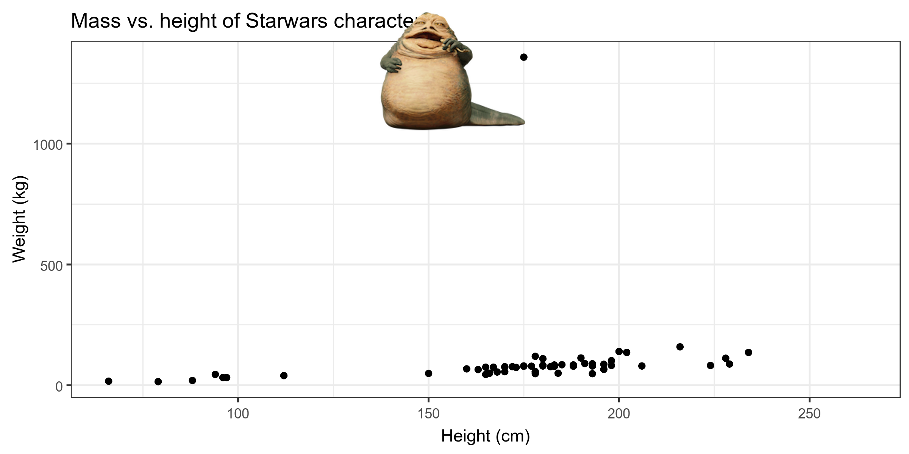

layout: true

<div class="my-footer">
<span>
<a href="http://datasciencebox.org" target="_blank">datasciencebox.org</a>
</span>
</div> 

---


```{r packages, echo=FALSE, message=FALSE, warning=FALSE}
library(tidyverse)
library(magick)
```

```{r setup, include=FALSE}
# R options
options(
  htmltools.dir.version = FALSE, # for blogdown
  show.signif.stars = FALSE,     # for regression output
  warm = 1
  )
# Set dpi and height for images
knitr::opts_chunk$set(fig.height = 2.5, fig.width = 5, dpi = 300) 
# ggplot2 color palette with gray
color_palette <- list(gray = "#999999", 
                      salmon = "#E69F00", 
                      lightblue = "#56B4E9", 
                      green = "#009E73", 
                      yellow = "#F0E442", 
                      darkblue = "#0072B2", 
                      red = "#D55E00", 
                      purple = "#CC79A7")
htmltools::tagList(rmarkdown::html_dependency_font_awesome())
# For magick
dev.off <- function(){
  invisible(grDevices::dev.off())
}
# For ggplot2
ggplot2::theme_set(ggplot2::theme_bw())
```


class: middle, center

## [Click for PDF of slides](03-data-and-viz.pdf)

---

class: center, middle

# Exploratory data analysis

---

## What is EDA?

- .vocab[Exploratory data analysis (EDA)] is an approach to analyzing data sets to summarize the main characteristics.

<br> 

- Often, EDA is visual. That's what we're focusing on today.

<br> 

- We can also calculate summary statistics and perform data wrangling/manipulation/transformation at (or before) this stage of the analysis.

---

class: center, middle

# Data visualization

---

## Data visualization

> *"The simple graph has brought more information to the data analyst’s mind than any other device." — John Tukey*

<br>

- .vocab[Data visualization] is the creation and study of the visual representation of data.

<br>

- There are many tools for visualizing data (R is one of them), and many approaches/systems within R for making data visualizations
    - We'll use  **`ggplot2`**.

---

## ggplot2 in tidyverse

.pull-left[
```{r echo = F, out.width = "70%"}
knitr::include_graphics("img/03/ggplot2-part-of-tidyverse.png")
```
]
.pull-right[
- **ggplot2** is tidyverse's data visualization package
- The `gg` in "ggplot2" stands for Grammar of Graphics
- It is inspired by the book **Grammar of Graphics** by Leland Wilkinson*

]

.footnote[ 
Source: [BloggoType](http://bloggotype.blogspot.com/2016/08/holiday-notes2-grammar-of-graphics.html)
]
---

## What is a Grammar of Graphics?

A tool that allows for concisely describing the components of a graphic:

```{r fig.align="center",out.width="70%",echo=FALSE}
knitr::include_graphics("img/03/grammar-of-graphics.png")
```


---

## What function is doing the plotting?

```{r echo = F}
# reduce number of categories for hair color
starwars <- starwars %>%
  mutate(hair_color = case_when(
    hair_color == "black" ~ "black",
    hair_color == "none" | is.na(hair_color) ~ "none",
    hair_color %in% c("brown", "brown, grey") ~ "brown", 
    TRUE ~ "other"
  ))
```

```{r fig.width = 7, fig.height=2, fig.align='center'}
ggplot(data = starwars, mapping = aes(x = height, y = mass)) +
  geom_point() + #<<
  labs(title = "Mass vs. height of Starwars characters",
       x = "Height (cm)", y = "Weight (kg)")
```

---

## What is the dataset being plotted?

```{r fig.width = 7, fig.height=2, fig.align='center'}
ggplot(data = starwars, mapping = aes(x = height, y = mass)) + #<<
  geom_point() + 
  labs(title = "Mass vs. height of Starwars characters",
       x = "Height (cm)", y = "Weight (kg)")
```

---

## Which variable is on the x-axis? On the y-axis?


```{r fig.width = 7, fig.height=2, fig.align='center'}
ggplot(data = starwars, mapping = aes(x = height, y = mass)) + #<<
  geom_point() + 
  labs(title = "Mass vs. height of Starwars characters",
       x = "Height (cm)", y = "Weight (kg)")
```

---

## What does the warning mean?


```{r fig.width = 7, fig.height=2, fig.align='center'}
ggplot(data = starwars, mapping = aes(x = height, y = mass)) +
  geom_point() +
  labs(title = "Mass vs. height of Starwars characters",
       x = "Height (cm)", y = "Weight (kg)")
```

---

## What does `geom_smooth()` do?

```{r fig.width = 7, fig.height=2, fig.align='center', warning = FALSE, message = FALSE}
ggplot(data = starwars, mapping = aes(x = height, y = mass)) +
  geom_point() +
  geom_smooth() + #<<
  labs(title = "Mass vs. height of Starwars characters",
       x = "Height (cm)", y = "Weight (kg)")
```

---

## Hello ggplot2!

- `ggplot()` is the main function in ggplot2 and plots are constructed in layers
- The structure of the code for plots can often be summarized as
```{r eval = FALSE}
ggplot + 
  geom_xxx
```

<br>

--

or, more precisely
.small[
```{r eval = FALSE}
ggplot(data = [dataset], mapping = aes(x = [x-variable], y = [y-variable])) +
   geom_xxx() +
   other options
```
]

---

## Hello ggplot2!

To use ggplot2 functions, first load tidyverse

```{r message = T, warning = T, eval = T}
library(tidyverse)
```


For help with the ggplot2, see [ggplot2.tidyverse.org](http://ggplot2.tidyverse.org/)

---

class: center, middle

# Visualizing Star Wars

---

## Dataset terminology

.small[
```{r message=FALSE}
starwars
```
]

Each row is an .vocab[observation]. Each column is a .vocab[variable]
---

## Luke Skywalker


---

## What's in the Star Wars data?

Take a `glimpse` of the data: 
```{r}
glimpse(starwars)
```

---

## What's in the Star Wars data?

Run the following **<u>in the Console</u>** to view the help
```{r eval = FALSE}
?starwars
```

```{r echo=FALSE, out.width = "60%"}
knitr::include_graphics("img/03/starwars-help.png")
```

---

## Mass vs. height

```{r fig.width = 7, fig.height=2.5, fig.align='center'}
ggplot(data = starwars, mapping = aes(x = height, y = mass)) +
  geom_point()
```

---

## What's that warning?

- Not all characters have height and mass information (hence 28 of them not plotted)

```
## Warning: Removed 28 rows containing missing values (geom_point).
```

- We can suppress warnings to save space on the output documents,  but it's important to note them

- To suppress warning: 
.center[
`{r code-chunk-label, warning=FALSE}`
]

---

## Mass vs. height

.question[
How would you describe this **relationship**? Who is the not so tall but really heavy character?
]

```{r fig.width = 7, fig.height=2.5, fig.align='center', warning=FALSE, echo = F}
ggplot(data = starwars, mapping = aes(x = height, y = mass)) +
  geom_point() +
  labs(title = "Mass vs. height of Starwars characters", #<<
       x = "Height (cm)", y = "Weight (kg)")             #<<
```

---

## Jabba!

```{r echo=FALSE, fig.align='center', warning=FALSE, message=FALSE}
jabba <- image_read("img/03/jabba.png")

fig <- image_graph(width = 2400, height = 1200, res = 300)
ggplot(data = starwars, mapping = aes(x = height, y = mass)) +
  geom_point(size = 1.5) + 
  labs(title = "Mass vs. height of Starwars characters",
       x = "Height (cm)", y = "Weight (kg)")
invisible(dev.off())

out <- fig %>% image_composite(jabba, offset = "+1000+30")

image_write(out, "img/03/jabbaplot.png", format = "png")


```

---

## Additional variables

We can map additional variables to various features of the plot:

- **aesthetics**
    - shape
    - color
    - size
    - alpha (transparency)
    
- **faceting**: small multiples displaying different subsets

---

class: center, middle

# Aesthetics

---

## Aesthetics options

Visual characteristics of plotting characters that can be **mapped to a specific variable**
in the data are

- `color`
- `size`
- `shape`
- `alpha` (transparency)

---

## Mass vs. height + hair color

```{r fig.width = 8, fig.height = 2.5, fig.align='center', warning=FALSE}
ggplot(data = starwars, mapping = aes(x = height, y = mass, 
                                      color = hair_color)) +
  geom_point()
```

---

## Mass vs. height + hair color

Let's map `shape` and `color` to `hair_color`

```{r fig.width = 7, fig.height = 2, fig.align='center', warning=FALSE}
ggplot(data = starwars, 
       mapping = aes(x = height, y = mass, color = hair_color,
                                      shape = hair_color#<<
                                      )) +
  geom_point()
```

---

### Mass vs. height + hair_color + birth year

```{r plot-birth-year, fig.width = 8, fig.height = 2.5, fig.align='center', warning=FALSE}
ggplot(data = starwars, mapping = aes(x = height, y = mass, 
                                      color = hair_color, shape = hair_color, 
                                      size = birth_year #<<
                                      )) +
  geom_point()
```

---

## Mass vs. height + hair color

Let's increase the size of all points across the board:

```{r fig.width = 8, fig.height=2.5, fig.align='center' , warning=FALSE}
ggplot(data = starwars, mapping = aes(x = height, y = mass, 
                                      color = hair_color)) +
  geom_point(size = 3) #<<
```

---

## Aesthetics summary

- Continuous variable are measured on a continuous scale
- Discrete variables are measured (or often counted) on a discrete scale

.small[
aesthetics    | discrete                 | continuous
------------- | ------------------------ | ------------
color         | rainbow of colors        | gradient
size          | discrete steps           | linear mapping between radius and value
shape         | different shape for each | shouldn't (and doesn't) work

]

<br>

.alert[Use aesthetics (`aes`) for mapping features of a plot to a variable, define the 
features in the `geom_xxx` for customization **<u>not</u>** mapped to a variable
]

---

class: center, middle

# Faceting

---

## Faceting options

- Smaller plots that display different subsets of the data
- Useful for exploring conditional relationships and large data


```{r warning=FALSE, eval = F}
ggplot(data = starwars, mapping = aes(x = height, y = mass)) +
  facet_grid(. ~ sex) + #<<
  geom_point() +
  labs(title = "Mass vs. height of Starwars characters",
       subtitle = "Faceted by sex",  #<<
       x = "Height (cm)", y = "Weight (kg)")
```


---

```{r fig.height = 2.5, fig.width=7, fig.align='center', warning=FALSE}
ggplot(data = starwars, mapping = aes(x = height, y = mass)) +
  facet_grid(. ~ sex) + #<<
  geom_point() +
  labs(title = "Mass vs. height of Starwars characters",
       subtitle = "Faceted by sex",  #<<
       x = "Height (cm)", y = "Weight (kg)")
```

---

## Dive further...

.question[
In the next few slides describe what each plot displays. Think about
how the code relates to the output.
]

--

<br><br><br>

.alert[
The plots in the next few slides do not have proper titles, axis labels, etc, so you can more easily focus on what's happening in the plots. But you 
should always label your plots!
]

---

```{r fig.height=2,fig.align='center', warning=FALSE}
ggplot(data = starwars, mapping = aes(x = height, y = mass)) +
  geom_point() +
  facet_grid(hair_color ~ .)
```

---

```{r fig.height=2,fig.align='center', warning=FALSE}
ggplot(data = starwars, mapping = aes(x = height, y = mass)) +
  geom_point() +
  facet_grid(. ~ hair_color)
```

---

```{r fig.height= 2.5, warning=FALSE}
ggplot(data = starwars, mapping = aes(x = height, y = mass)) +
  geom_point() +
  facet_wrap(~ eye_color)
```

---

## Facet summary

- `facet_grid()`: 
    - 2d grid
    - `rows ~ cols`
    - use `.` for no split

--

- `facet_wrap()`: 1d ribbon wrapped into 2d

---

## `ggplot2` supplementary resources

1. [ggplot2.tidyverse.org](https://ggplot2.tidyverse.org/)
2. `ggplot2` [cheat sheet](https://github.com/rstudio/cheatsheets/raw/master/data-visualization-2.1.pdf)
3. STA 523 `ggplot2` [slides](https://shawnsanto.com/files/sta523/slides/lec-3b-ggplot2.html#1)
4. [Top 50 `ggplot2` visualizations](http://r-statistics.co/Top50-Ggplot2-Visualizations-MasterList-R-Code.html)
5. [How the BBC uses `ggplot2`](https://medium.com/bbc-visual-and-data-journalism/how-the-bbc-visual-and-data-journalism-team-works-with-graphics-in-r-ed0b35693535)
6. [ggplot2: Elegant Graphics for Data Analysis](https://ggplot2-book.org/)
