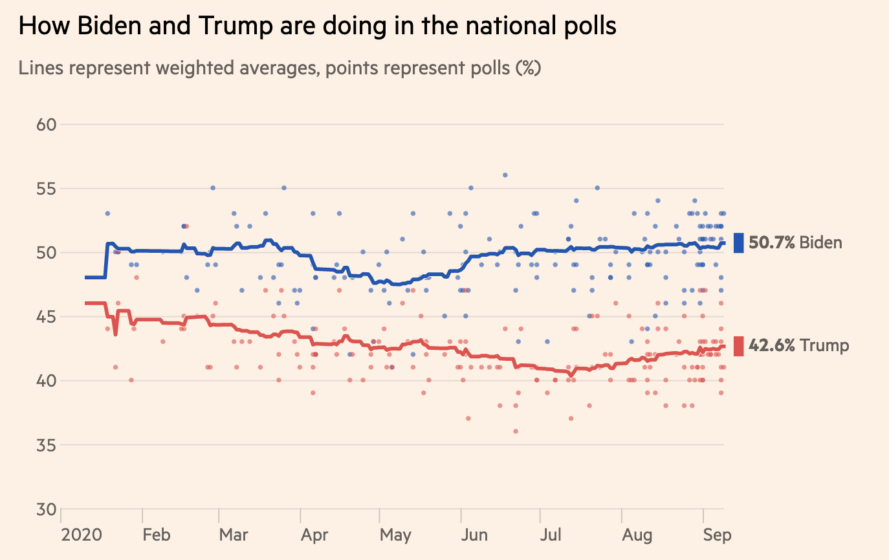
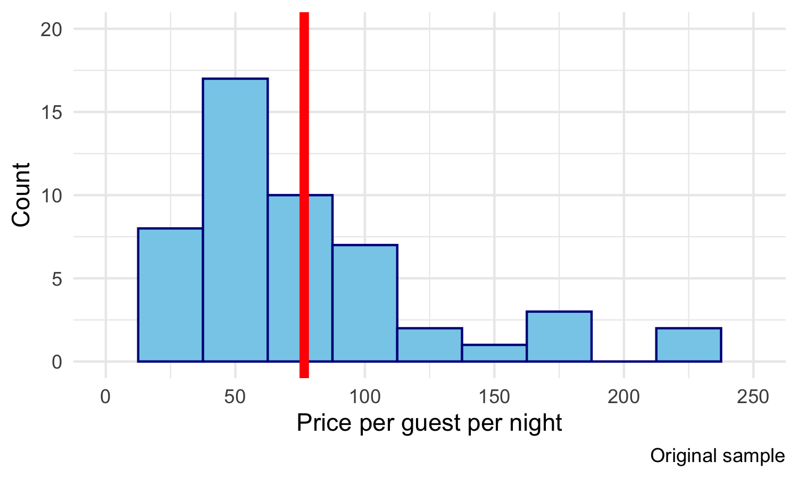
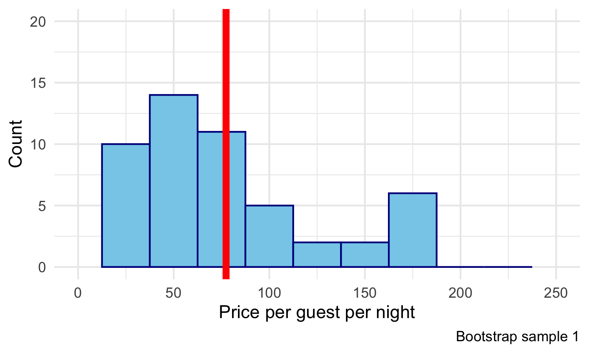
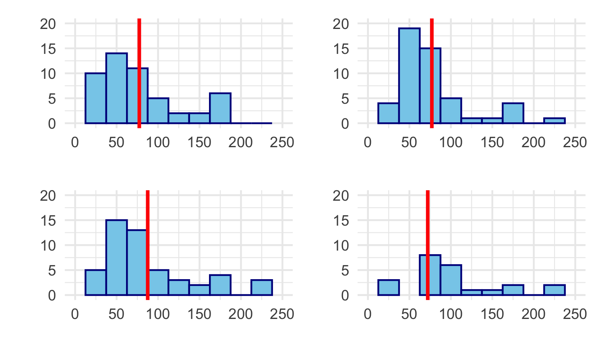
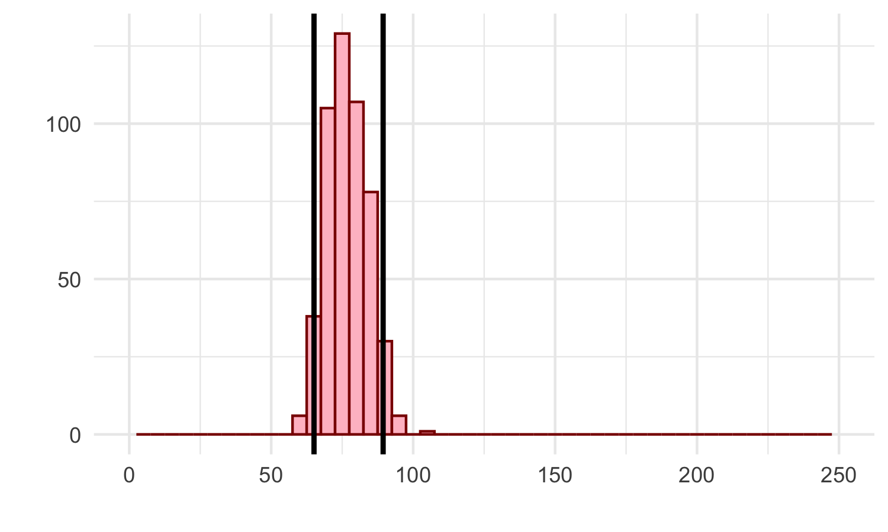
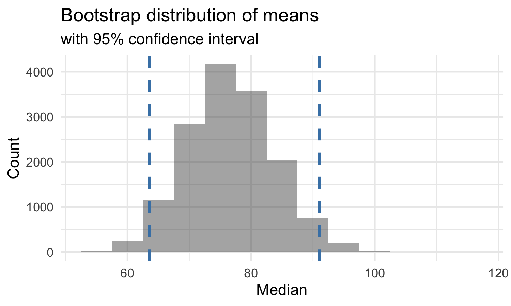

layout: true

<div class="my-footer">
<span>
<a href="http://datasciencebox.org" target="_blank">datasciencebox.org</a>
</span>
</div> 


---

class: middle center

## [Click for PDF of slides](09-bootstrap-infer.pdf)

---

class: center, middle

# Inference

---

## Terminology

.vocab[Population]: a group of individuals or objects we are interested in studying

.vocab[Parameter]: a numerical quantity derived from the population
(almost always unknown)

If we had data from every unit in the population, we could just calculate 
population parameters and be done!

--

**Unfortunately, we usually cannot do this.**

.vocab[Sample]: a subset of our population of interest

.vocab[Statistic]: a numerical quantity derived from a sample

---

## Inference

If the sample is .vocab[representative], then we can use the tools of probability and statistical inference to make .vocab[generalizable] conclusions to the broader population of interest.


Similar to tasting a spoonful of soup while cooking to make an inference about the entire pot.

---

## Statistical inference

.vocab[Statistical inference] is the process of using sample data to make 
  conclusions about the underlying population the sample came from.

- .vocab[Estimation]: using the sample to estimate a plausible range of values for the unknown parameter

- .vocab[Testing]: evaluating whether our observed sample provides evidence 
for or against some claim about the population

Today we will focus on **estimation**.

---

class: center, middle

# Estimation

---

## Let's \*virtually\* go to Asheville! 

.center[


**How much should we expect to pay for an Airbnb in Asheville?**
]

---

## Asheville data

[Inside Airbnb](http://insideairbnb.com/) scraped all Airbnb listings in 
Asheville, NC, that were active on June 25, 2020.

**Population of interest**: listings in the Asheville with at least ten reviews.

**Parameter of interest**: Mean price per guest per night among these 
listings.

.question[
What is the mean price per guest per night among Airbnb rentals in June 2020, 
among Airbnbs with at least ten reviews in Asheville (zip codes 28801 - 28806)?
]

We have data on the price per guest (`ppg`) for a random
sample of 50 Airbnb listings.

---

## Point estimate

A .vocab[point estimate] is a single value computed from the sample data to serve
as the "best guess", or estimate, for the population parameter. 


```r
abb <- read_csv("data/asheville.csv")

abb %>% 
  summarize(mean_price = mean(ppg))
```

```
## # A tibble: 1 x 1
##   mean_price
##        <dbl>
## 1       76.6
```

---

## Visualizing our sample


---

.question[
If you want to catch a fish, do you prefer a spear or a net?
]

.pull-left[

]
.pull-right[

]

---

.question[
If you want to estimate a population parameter, do you prefer to report a range 
of values the parameter might be in, or a single value?
]

.pull-left[

]
.pull-right[

]

---

- If we report a point estimate, we probably won’t hit the exact population 
parameter.

- If we report a range of plausible values we have a good shot at capturing 
the parameter.

---



.footnote[
Source: [Biden vs Trump: who is leading the 2020 US election polls?](https://ig.ft.com/us-election-2020/), 10 Sep 2020.
]


---

class: middle, center

## Confidence intervals

---

## Variability of sample statistics

For a confidence interval for the population mean, we need to come up with a
range of plausible values around our observed sample mean.

- Remember that random samples may differ from each other. If we took another
random sample of 50 Airbnb listings, we probably wouldn't get the same mean
price per guest.

- There is some .vocab[variability] of the sample mean from these listings.

- To construct a confidence interval, we need to quantify this variability. This
gives us a measurement of how much we expect the sample mean to vary from
sample to sample.

---

.question[
Suppose we split the class in half and ask each student their height. Then, we calculate the mean height of students 
on each side of the classroom. Would you expect these two means to be exactly 
equal, close but not equal, or wildly different?
]

--

<br><br>

.question[
Suppose you randomly sample 50 students and 5 of them are left handed. If you 
were to take another random sample of 50 students, how many would you expect to 
be left handed? Would you be surprised if only 3 of them were left handed? Would 
you be surprised if 40 of them were left handed?
]

---

## Quantifying the variability

We can quantify the variability of sample statistics using different approaches:

- **Simulation**: via bootstrapping or "resampling" techniques (**today's focus**)

or

- **Theory**: via the Central Limit Theorem (**coming soon!**)

---

class: center, middle

# Bootstrapping

---

## The bootstrap principle


- The term .vocab[bootstrapping] comes from the phrase "pulling oneself up by one’s 
bootstraps", which is a metaphor for accomplishing an impossible task without 
any outside help.

- In this case the impossible task is estimating a population parameter, and we’ll 
accomplish it using data from only the given sample.

- This notion of saying something about a population parameter using 
only information from an observed sample is the crux of statistical inference, 
it is not limited to bootstrapping.

---

## The bootstrap procedure

1. Take a .vocab[bootstrap sample] - a random sample taken **with replacement**
from the original sample, **of the same size** as the original sample.

2. Calculate the bootstrap statistic: the statistic you’re interested in (the 
mean, the median, the correlation, etc.) computed on the bootstrap sample.

3. Repeat steps (1) and (2) many times to create a .vocab[bootstrap distribution] - a distribution of bootstrap statistics.

4. Calculate the bounds of the XX% confidence interval as the middle XX% of the bootstrap distribution.

---

## The original sample

<br><br>



---

## Step-by-step

**Step 1.** Take a .vocab[bootstrap sample]: a random sample taken 
**with replacement** from the original sample, **of the same size** as the 
original sample:


---

## Step-by-step

**Step 2.** Calculate the bootstrap statistic (in this case, the sample mean) 
using the bootstrap sample:



---

## Step-by-step

**Step 3.** Do steps 1 and 2 over and over again to create a bootstrap 
distribution of sample means:

.pull-left[


]

.pull-right[


]


              
---

## Step-by-step

**Step 3.** In this plot, we've taken 500 bootstrap samples, calculated the
sample mean for each, and plotted them in a histogram:


---

**Here we compare the bootstrap distribution of sample means to that 
of the original data. What do you notice?**


---

## Step-by-step

**Step 4.** Calculate the bounds of the bootstrap interval by using percentiles 
of the bootstrap distribution



---

class: center, middle

# Bootstrapping in R

---

## Package `infer`

.pull-left[

<br><br>
[infer.netlify.com](http://infer.netlify.com)
]

.pull-right[
<br/><br/><br/><br/>
The objective of package `infer` is to perform statistical inference using an 
expressive statistical grammar that coheres with the tidyverse design framework.


```r
library(infer)
```
]

---

## Set a seed

Let's set a seed


```r
set.seed(123)
```

Function `set.seed()` is a base R function that allows us to control R's
random number generation. Use this to make your simulation work reproducible.

In other words, it ensures we'll get the same random sample each time we run the code or knit.

---

## Generate bootstrap means


```r
abb %>%
  # specify the variable of interest
* specify(response = ppg)
```

---

## Generate bootstrap means


```r
abb %>%
  # specify the variable of interest
  specify(response = ppg) %>% 
  # generate 15000 bootstrap samples
* generate(reps = 15000, type = "bootstrap")
```

---

## Generate bootstrap means


```r
abb %>%
  # specify the variable of interest
  specify(response = ppg) %>% 
  # generate 15000 bootstrap samples
  generate(reps = 15000, type = "bootstrap") %>% 
  # calculate the statistic of each bootstrap sample
* calculate(stat = "mean")
```

---

## Generate bootstrap means


```r
# save resulting bootstrap distribution
*boot_dist <- abb %>%
  # specify the variable of interest
  specify(response = ppg) %>% 
  # generate 15000 bootstrap samples
  generate(reps = 15000, type = "bootstrap") %>% 
  # calculate the statistic of each bootstrap sample
  calculate(stat = "mean")
```

---

## Sample means

How many observations are there in `boot_dist`? What does each observation 
represent?

--


```r
boot_dist
```

```
## # A tibble: 15,000 x 2
##    replicate  stat
##        <int> <dbl>
##  1         1  72.5
##  2         2  79.7
##  3         3  63.0
##  4         4  73.1
##  5         5  67.1
##  6         6  78.1
##  7         7  92.1
##  8         8  95.7
##  9         9  88.5
## 10        10  90.8
## # … with 14,990 more rows
```

---

## Visualize the distribution


---

## Calculate the confidence interval

A 95% confidence interval is bounded by the middle 95% of the bootstrap 
distribution.

--

Use `dplyr` functions:


```r
boot_dist %>%
  summarize(lower_bound = quantile(stat, 0.025),
            upper_bound = quantile(stat, 0.975))
```

```
## # A tibble: 1 x 2
##   lower_bound upper_bound
##         <dbl>       <dbl>
## 1        63.5        91.0
```

---

## Visualize a confidence interval

Using `geom_vline()` to mark the bounds of the confidence interval





---

## Interpreting a confidence interval

Using the 2.5th and 97.5th quantiles as bounds for our confidence interval gives 
us the middle 95% of the bootstrap means. Our 95% CI is 
(63.5, 91).

.question[
Does this mean there is a 95% chance that the true mean price per night in the
population is contained in the interval 
(63.5, 91)?
]


---

class: center, middle

# <span style="color:red">NO</span> ❌

---

## Interpreting a confidence interval

- The population parameter is either in our interval or it isn't. It can't have a
"95% chance" of being in any specific interval.

--

- The bootstrap distribution captures the variability of the sample mean, but is
based on our original sample. If we started with a different sample,then maybe our estimated 95% confidence 
interval would have been different also.

--

- All we can say is that, if we were to independently take repeated samples from
this population and calculate a 95% CI for the mean in the exact same way, then
we would *expect* 95% of these intervals to contian the population mean.

--

- However, we never know if any particular interval(s) actually do!

---

## Interpretation 

.question[
**We are 95% confident that the mean price per night for Airbnbs in Asheville, NC is between $63.5 and $ 91. **
]
