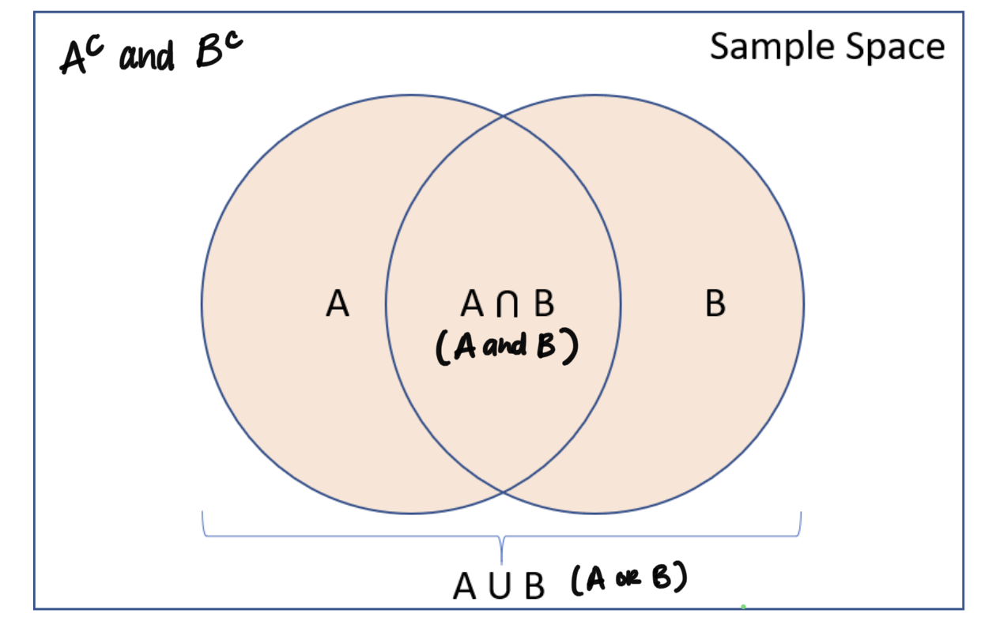

```{r include = F}
library(tidyverse)
```


## Announcements

- Lab 03 due Wednesday  at 11:59p

## Questions about Lab 03 and teamwork? 

## Questions from Lec 07 video? 

## Using a Venn Diagram

```{r echo = F, fig.align = "center"}

```


## Coffee vs. Mortality (from Lec 07 video)

**Note: There are 69,164 people included in this study.**s

```{r, echo = F}
coffee <- c(rep("Does not drink coffee", 6477), rep("Drinks coffee occasionally", 34152), rep("Drinks coffee regularly", 28535))
died <- c(rep("Died", 1039), rep("Did not die", 5438), 
          rep("Died", 4440), rep("Did not die", 29712),
          rep("Died", 3601), rep("Did not die", 24934))
knitr::kable(table(coffee, died))
```

Define events *A* = died and *B* = non-coffee drinker. Calculate the following for a randomly selected person in the cohort:

- $P(A)$
- $P(B)$
- $P(A \text{ and } B)$
- $P(A \text{ or } B)$
- $P(A \text{ or } B)$

## Clone a repo + start a new project

Go to the `ae-07-[GITHUB USERNAME]` repo, clone it, and start a new project in RStudio. See the [Lab 01](https://sta199-fa20-002.netlify.app/labs/lab-01-hello-r.html#getting-started) for more detailed instructions about cloning a repo and starting a new project. 

## Configure git

Run the following code to configure Git. Fill in your GitHub username and the email address associated with your GitHub account. 

```{r eval=FALSE}
library(usethis)
use_git_config(user.name = "your github username", user.email ="your email")
```

```{r load-packages, eval = F}
library(tidyverse)
```

The following tables are representative of the SIROCCO trial (Bleecker et al.,
2016), which examined the safety and efficacy of benralizumab for patients with 
severe, poorly controlled asthma. The tables present baseline demographic
information for patients enrolled in the file. **There were 1204 patients in this study.**

You may knit the document to see the tables. "Q4W" means "every four weeks" and 
"Q8W" means "every eight weeks.

```{r asthma-data, echo = F}

trt <- c(rep("Placebo", 407), 
         rep("Benralizumab Q4W", 398), 
         rep("Benralizumab Q8W", 399))

sex <- c(rep("Male", 138), rep("Female", 269),
         rep("Male", 124), rep("Female", 275),
         rep("Male", 146), rep("Female", 252))

race <- c(rep("White", 302), rep("Black", 16), rep("Asian", 50), rep("Other", 39),
          rep("White", 285), rep("Black", 15), rep("Asian", 54), rep("Other", 45),
          rep("White", 287), rep("Black", 15), rep("Asian", 50), rep("Other", 46))

knitr::kable(table(trt, sex))
knitr::kable(table(trt, race))
```

Answer the following questions using the table provided above (knit this
document first to see the tables!). If a probability cannot be calculated, indicate what 
additional information is needed in order to do so.

- What is the probability that a randomly selected patient in the trial was 
assigned to placebo?
- What is the probability that a randomly selected patient in the trial was 
male?
- What is the probability that a randomly selected patient in the trial was 
assigned to placebo **or** was male?
- What is the probability that a randomly assigned patient in the trial was 
assigned to placebo **and** was male?
- What is the probability that a randomly assigned patient in the trial was
male **or** was white?
