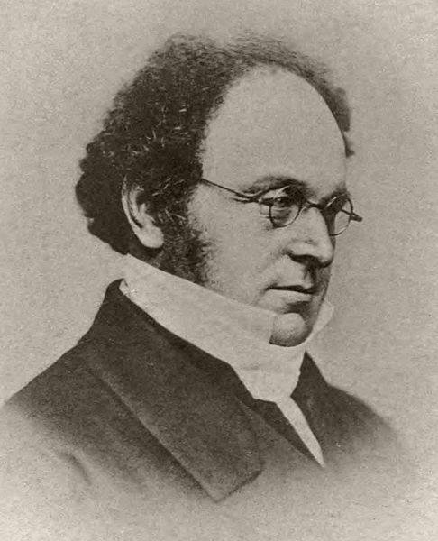
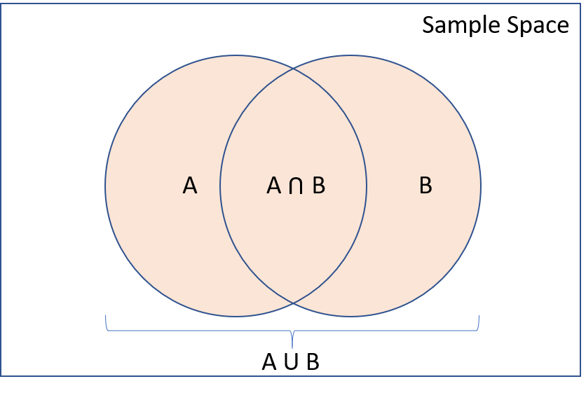

layout: true

<div class="my-footer">
<span>
<a href="http://datasciencebox.org" target="_blank">datasciencebox.org</a>
</span>
</div> 

---

```{r setup, include=FALSE}
# R options
options(
  htmltools.dir.version = FALSE, # for blogdown
  show.signif.stars = FALSE,     # for regression output
  warm = 1
  )
# Set dpi and height for images
knitr::opts_chunk$set(fig.height = 3, fig.width = 5, dpi = 300, 
                      warning = FALSE, 
                      message = FALSE) 
# ggplot2 color palette with gray
color_palette <- list(gray = "#999999", 
                      salmon = "#E69F00", 
                      lightblue = "#56B4E9", 
                      green = "#009E73", 
                      yellow = "#F0E442", 
                      darkblue = "#0072B2", 
                      red = "#D55E00", 
                      purple = "#CC79A7")
htmltools::tagList(rmarkdown::html_dependency_font_awesome())
# For magick
dev.off <- function(){
  invisible(grDevices::dev.off())
}
# For ggplot2
ggplot2::theme_set(ggplot2::theme_bw())
```

```{r packages, echo=FALSE, message=FALSE, warning=FALSE}
library(tidyverse)
```

class: middle, center

## [Click for PDF of slides](07-probability-intro.pdf)

---

## What we've done so far...

- Use visualization techniques to *visualize* data  
- Use descriptive statistics to *describe* and *summarize* data
- Use data wrangling tools to *manipulate* data
- ...all using the reproducible, shareable tools of R and git

That's all great, but what we eventually want to do is to *quantify uncertainty*
in order to make **principled conclusions** about the data
  
---

## The statistical process

.pull-left[
Statistics is a process that converts data into useful information, where
practitioners

`r emo::ji("one")` form a question of interest,

`r emo::ji("two")` collect and summarize data,

`r emo::ji("three")` and interpret the results.
]

.pull-right[
```{r quack, echo=FALSE, out.width=300, fig.align="center"}

```
]

---

## The population of interest

The .vocab[population] is the group we'd like to learn something about. For 
example:

.small[
- What is the prevalence of diabetes among **U.S. adults**, and has it changed
over time? 
- Does the average amount of caffeine vary by vendor in **12 oz. cups of**
**coffee at Duke coffee shops**?
- Is there a relationship between tumor type and five-year mortality among
**breast cancer patients**?
]

The .vocab[research question of interest] is what we want to answer - often 
relating one or more numerical quantities or summary statistics.

If we had data from every unit in the population, we could just calculate what
we wanted and be done!

---

## Sampling from the population

Unfortunately, we (usually) have to settle with a .vocab[sample] from the
population.

Ideally, the sample is .vocab[representative] (has similar characteristics as the population), allowing us to make conclusions 
that are .vocab[generalizable] (i.e. applicable) to the broader population of interest. 

<br> 

We'll use probability and statistical inference (more on this later!) to draw conclusions about the population based on our sample.

---

class: center, middle


# Interpreting probabilities

---

## Interpretations of probability

<br>

```{r box, echo=FALSE, out.width = "50%", fig.align="center"}
knitr::include_graphics("img/07/box.png")
```

.center[
*"There is a 1 in 3 chance of selecting a white ball"*
]

---

## Interpretations of probability

<br>

```{r rain, echo=FALSE, out.width = "50%" , fig.align="center"}

```

.center[
*"There is a 75% chance of rain tomorrow"*
]

---

## Interpretations of probability

<br>

```{r surgery, echo=FALSE, out.width = "50%", fig.align="center"}
knitr::include_graphics("img/07/surgery.jpg")
```

.center[
*"The surgery has a 50% probability of success"*
]

---

## Interpretations of probability

<br>

```{r surgery-2, echo=FALSE, out.width = "50%", fig.align="center"}
knitr::include_graphics("img/07/surgery.jpg")
```

.center[
.vocab[Long-run frequencies] vs. .vocab[degree of belief]
]

---

class: center, middle


# Formalizing probabilities

---

## What do we need?

We can think of probabilities as objects that model random phenomena. We'll use three components to talk about probabilities:


`r emo::ji("one")` .vocab[Sample space]: the set of all possible .vocab[outcomes]

`r emo::ji("two")` .vocab[Events]: Subsets of the sample space, comprise any number of possible outcomes (including none of them!)

`r emo::ji("three")` .vocab[Probability]: Proportion of times an event would occur if we observed the random phenomenon an infinite number of times.

---

## Sample spaces

Sample spaces depend on the random phenomenon in question

- Tossing a single fair coin

- Sum of rolling two fair six-sided dice

- Guessing the answer on a multiple choice question with choices *a, b, c, d*.

<br> 

.question[
What are the sample spaces for the random phenomena above?
]

---

## Events

.vocab[Events] are subsets of the sample space that comprise all possible outcomes from
that event. These are the "plausibly reasonable" outcomes we may want to calculate the probabilities for

- Tossing a single fair coin

- Sum of rolling two fair six-sided dice

- Guessing the answer on a multiple choice question with choices *a, b, c, d*.

.question[
What are some examples of events for the random phenomena above?
]

---

## Probabilities

Consider the following possible events and their corresponding probabilities:

- Getting a head from a single fair coin toss: **0.5**
- Getting a prime number sum from rolling two fair six-sided dice: **5/12**
- Guessing the correct answer: **1/4**

<br> 

*We'll talk more about how we calculated these probabilities, but for now remember that
probabilities are numbers describing the likelihood of each event's occurrence,
which map events to a number between 0 and 1, inclusive.*

---

class: center, middle

# Working with probabilities

---

## Set operations

Remember that events are (sub)sets of the outcome space. For two sets (in this
case events) $A$ and $B$, the most common relationships are:
 
- .vocab[Intersection] $(A \text{ and } B)$: $A$ **and** $B$ both occur
- .vocab[Union] $(A \text{ or } B)$: $A$ **or** $B$ occurs (including when both occur)
- .vocab[Complement] $(A^c)$: $A$ does **not** occur

<br> 

Two sets $A$ and $B$ are said to be .vocab[disjoint] or .vocab[mutually exclusive] if they cannot happen at the same time, i.e. $A \text{ and } B = \emptyset$. 

---

## Combining set operations

.pull-left[
DeMorgan's laws

- Complement of union: $(A \text{ or } B)^c = A^c \text{ and } B^c$
- Complement of intersection: $(A \text{ and } B)^c = A^c \text{ or } B^c$

These can be straightforwardly extended to more than two events
]

.pull-right[
```{r demorgan, echo=FALSE, out.width = 400, fig.align="center"}

```
]

---

## How do probabilities work?

.vocab[Kolmogorov axioms]

`r emo::ji("white_check_mark")` The probability of any event is real number that's $\geq 0$ 

`r emo::ji("white_check_mark")` The probability of the entire sample space is 1

`r emo::ji("white_check_mark")` If $A$ and $B$ are disjoint events, then $P(A \text{ or } B) = P(A) + P(B)$

<br> 

The Kolmogorov axioms lead to all probabilities being between 0 and 1 inclusive, and also lead to important rules...

---

## Two important rules

Suppose we have events $A$ and $B$, with probabilities $P(A)$ and $P(B)$ of
occurring. Based on the Kolmogorov axioms: 

- .vocab[Complement Rule]: $P(A^c) = 1 - P(A)$
- .vocab[Inclusion-Exclusion]: $P(A \text{ or } B) = P(A) + P(B) - P(A \text{ and } B)$

```{r ie, echo=FALSE, out.width = "45%", fig.align="center"}

```

---

## Practicing with probabilities

```{r gunter, echo=FALSE, out.width = 700, fig.align="center"}
knitr::include_graphics("img/07/coffee.png")
```

```{r, echo = F}
coffee <- c(rep("Does not drink coffee", 6477), rep("Drinks coffee occasionally", 34152), rep("Drinks coffee regularly", 28535))
died <- c(rep("Died", 1039), rep("Did not die", 5438), 
          rep("Died", 4440), rep("Did not die", 29712),
          rep("Died", 3601), rep("Did not die", 24934))
knitr::kable(table(coffee, died))
```

<br> 

Source: https://www.ncbi.nlm.nih.gov/pmc/articles/PMC5788283/


---

## Practicing with probabilities
.midi[
```{r, echo = F}
coffee <- c(rep("Does not drink coffee", 6477), rep("Drinks coffee occasionally", 34152), rep("Drinks coffee regularly", 28535))
died <- c(rep("Died", 1039), rep("Did not die", 5438), 
          rep("Died", 4440), rep("Did not die", 29712),
          rep("Died", 3601), rep("Did not die", 24934))
knitr::kable(table(coffee, died))
```
]

.question[
.midi[
Define events *A* = died and *B* = non-coffee drinker. Calculate the following for a randomly selected person in the cohort:]
- $\small{P(A)}$
- $\small{P(B)}$
- $\small{P(A \text{ and } B)}$
- $\small{P(A \text{ or } B)}$
- $\small{P(A \text{ or } B^c)}$
]

