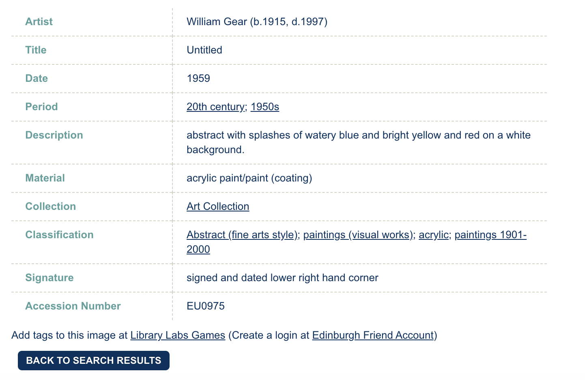
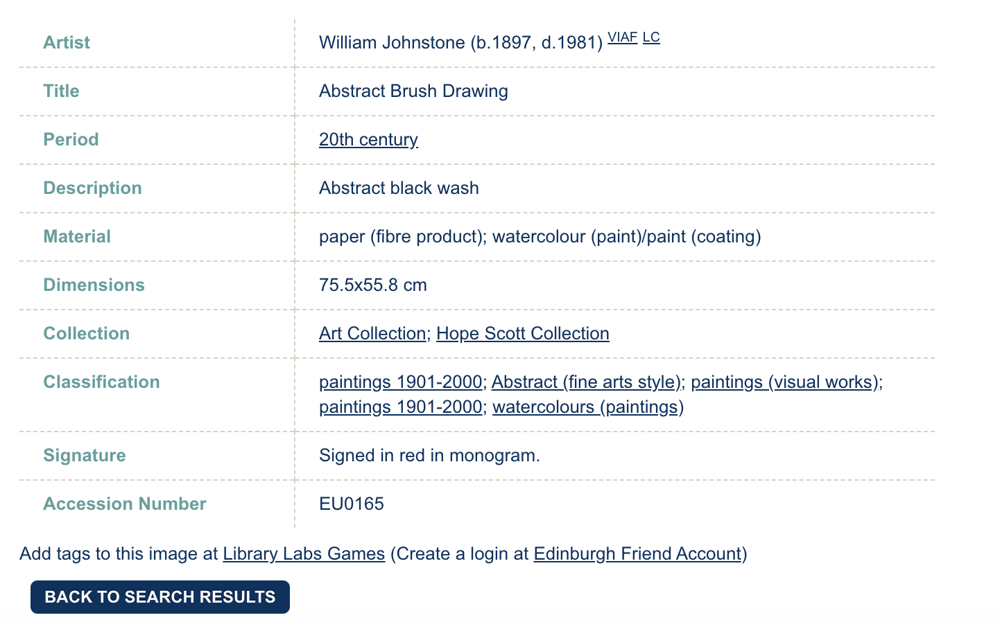

layout: true

<div class="my-footer">
<span>
<a href="http://datasciencebox.org" target="_blank">datasciencebox.org</a>
</span>
</div> 

```{r packages, echo=FALSE, message=FALSE, warning=FALSE}
knitr::opts_chunk$set(echo = T, warning = F, message =F, 
                      fig.align = "center")

library(tidyverse)
library(scales)
library(here)
library(rvest)
library(DT)
```

---

class: middle center

## [Click for PDF of slides](26-functions.pdf)

---

class: middle

# Edinburgh College of Art Collection
## Abstract Art

---

```{r include=FALSE}
uoe_art <- read_csv("data/uoe_abstract_art.csv")
```

```{r echo=FALSE}
uoe_art
```

[Click here](scrape-art-info.R) to see the code used to scrape the data.
---

```{r echo=FALSE, out.width="80%"}
knitr::include_graphics("img/26/untitled-1963.png")
```

---

```{r echo=FALSE, out.width="80%"}
knitr::include_graphics("img/26/untitled-1963-headers-values.png")
```

---

```{r echo=FALSE, out.width="100%"}
knitr::include_graphics("img/26/untitled-1963-to-df.png")
```

---

.small[
```{r eval=FALSE}
# load packages ----------------------------------------------------------------
library(tidyverse)
library(rvest)

# first url 

## set url 
first_info_url <- "https://collections.ed.ac.uk/art/./record/20144?highlight=*:*"

## read page at url
page <- read_html(first_info_url)

## scrape headers 
headers <- page %>%
  html_nodes("th") %>%
  html_text()

## scrape values 
values <- page %>%
  html_nodes("td") %>%
  html_text() %>%
  str_squish()

## put together in a tibble and add link to help keep track ----
tibble(headers, values) %>%
  pivot_wider(names_from = headers, values_from = values) %>%
  add_column(link = first_info_url)
```
]

---

class: middle

# Functions

---

## When should you write a function?

--

Whenever you’ve copied and pasted a block of code more than twice.

<br><br>

--

.question[
How many times will we need to copy and paste the code we developed to scrape 
additional data on each abstract art piece in the Edinburgh College of Art Collection?
]

--

.vocab[179 more times!]

---

## Why functions?

- Automate common tasks in a more powerful and general way than copy-and-pasting:
    - You can give a function an evocative name that makes your code easier to understand.
    - As requirements change, you only need to update code in one place, instead of many.
    - You eliminate the chance of making incidental mistakes when you copy and paste (i.e. updating a variable name in one place, but not in another).

--

- Down the line: Improve your reach as a data scientist by writing functions 
(and packages!) that others use

---

## How many inputs in the following code?

.small[
```{r eval=FALSE}
## set url ----
first_info_url <- "https://collections.ed.ac.uk/art/./record/20144?highlight=*:*"

## read page at url ----
page <- read_html(first_info_url)

## scrape headers ----
headers <- page %>%
  html_nodes("th") %>%
  html_text()

## scrape values ----
values <- page %>%
  html_nodes("td") %>%
  html_text() %>%
  str_squish()

## put together in a tibble and add link to help keep track ----
tibble(headers, values) %>%
  pivot_wider(names_from = headers, values_from = values) %>%
  add_column(link = first_info_url)
```
]

---

## How many inputs in the following code?

.small[
```{r eval=FALSE}
## set url ----
first_info_url <- "https://collections.ed.ac.uk/art/./record/20144?highlight=*:*" #<<

## read page at url ----
page <- read_html(first_info_url) #<<

## scrape headers ----
headers <- page %>%
  html_nodes("th") %>%
  html_text()

## scrape values ----
values <- page %>%
  html_nodes("td") %>%
  html_text() %>%
  str_squish()

## put together in a tibble and add link to help keep track ----
tibble(headers, values) %>%
  pivot_wider(names_from = headers, values_from = values) %>%
  add_column(link = first_info_url) #<<
```
]

---

## Turn your code into a function

- Pick a short but informative .vocab[name], preferably a verb.

<br>
<br>
<br>
<br>

```{r eval=FALSE}
scrape_art_info <- 
  
  
  
  
  
  
```

---

## Turn your code into a function

- Pick a short but evocative .vocab[name], preferably a verb.
- List inputs, or .vocab[arguments], to the function inside `function`. If we had more arguments the call would look like `function(x, y, z)`.

<br>

```{r eval=FALSE}
scrape_art_info <- function(x){
  
  
  
  
  
}  
```

---

## Turn your code into a function

- Pick a short but informative .vocab[name], preferably a verb.
- List inputs, or .vocab[arguments], to the function inside `function`. If we had more the call would look like `function(x, y, z)`.
- Place the .vocab[code] you have developed in body of the function, a `{}` block that immediately follows `function(...)`.

```{r eval=FALSE}
scrape_art_info <- function(x){

  # code we developed earlier to scrape info 
  # on single art piece goes here
  
}
```

---

.midi[
```{r}
scrape_art_info <- function(x){
  
  # read page at url ----
  page <- read_html(x)
  
  # scrape headers ----
  headers <- page %>%
    html_nodes("th") %>%
    html_text()
  
  # scrape values ----
  values <- page %>%
    html_nodes("td") %>%
    html_text() %>%
    str_squish()

  # put together in a tibble and add link to help keep track ----
  tibble(headers, values) %>%
    pivot_wider(names_from = headers, values_from = values) %>%
    add_column(link = x)
  
}
```
]

---

## Function in action

.midi[
```{r}
scrape_art_info(uoe_art$link[1]) %>%
  glimpse()
```
]




---

## Function in action

.midi[
```{r}
scrape_art_info(uoe_art$link[2]) %>%
  glimpse()
```
]



---

## What goes in / what comes out?

- They take input(s) defined in the function definition

.midi[
```{r eval=FALSE}
function([inputs separated by commas]){
  # what to do with those inputs
}
```
]

- By default they return the last value computed in the function

.midi[
```{r eval=FALSE}
scrape_page <- function(x){
  # do bunch of stuff with the input...
  
  # return a tibble
  tibble(...)
}
```
]

- You can define more outputs to be returned in a list as well as nice print methods (but we won't go there for now...)

---

.question[
What is going on here?
]

```{r}
add_2 <- function(x){
  x + 2
  1000
}
```

```{r}
add_2(3)
add_2(10)
```

---

## Naming functions

> "There are only two hard things in Computer Science: cache invalidation and naming things." - Phil Karlton


--
- Names should be short but clearly evoke what the function does

--
- Names should be verbs, not nouns

--
- Multi-word names should be separated by underscores (`snake_case` as opposed to `camelCase`)

--
- A family of functions should be named similarly (`scrape_page`, `scrape_art_info` OR `str_squish`, `str_trim`, `str_remove` etc.)

--
- Avoid overwriting existing (especially widely used) functions

.small[
```{r eval=FALSE}
# JUST DON'T
mean <- function(x){ 
  x * 3 
  }
```
]

---

class: middle

# Automation

---

## Define the task

- Goal: Scrape info on all 180 abstract art in the collection
- So far:
.small[
```{r eval=FALSE}
scrape_art_info(uoe_art$link[1])
scrape_art_info(uoe_art$link[2])
scrape_art_info(uoe_art$link[3])
```
]
- What else do we need to do?
  - Run the `scrape_art_info()` function on all 180 links
  - Combine the resulting data frames from each run into one giant data frame with 180 rows
  
---

## Inputs

.question[
You now have a function that will scrape the relevant info on art pieces given the URL of its individual info page. Where can we get a list of URLs of each of the art pieces in the collection?
]

--

From the original data frame!

.midi[
```{r}
uoe_art
```
]

---

## Automation

.question[
How can we tell R to apply the `scrape_art_info()` function to each link in `uoe_art$link`?
]

--

- Option 1: Write a .vocab[for loop], i.e. explicitly tell R to visit a link, apply the function, store the result, then visit the next link, apply the function, append the result to the stored result from the previous link, and so on and so forth.
--

- Option 2: .vocab[Map] the function to each element in the list of links, and let R take care of the storing and appending of results.

--

**We'll go with Option 2 for now.**

---

## How does mapping work?

Suppose we have exam 1 and exam 2 scores of 4 students stored in a list...

.midi[
```{r}
exam_scores <- list(
  exam1 <- c(80, 90, 70, 50),
  exam2 <- c(85, 83, 45, 60)
)
```
]

--

...and we find the mean score in each exam

.midi[
```{r}
map(exam_scores, mean)
```
]

---

...and suppose we want the results as a numeric (double) vector

```{r}
map_dbl(exam_scores, mean)
```

--

...or as a character string

```{r}
map_chr(exam_scores, mean)
```

---

## `map_something`

Functions for looping over an object and returning a value (of a specific type):

* `map()` - returns a list
* `map_lgl()` - returns a logical vector
* `map_int()` - returns an integer vector
* `map_dbl()` - returns a double vector
* `map_chr()` - returns a character vector
* `map_df()` / `map_dfr()` - returns a data frame by row binding
* `map_dfc()` - returns a data frame by column binding
* ...

---

## Go to each page, scrape art info 

- Map the `scrape_art_info()` function
- to each element of `uoe_art$link`
- and return a data frame by row binding

```{r eval=FALSE}
uoe_art_info <- map_df(uoe_art$link, scrape_art_info)
```

---

```{r include=FALSE}
uoe_art_info_1 <- read_csv("data/uoe_abstract_art_info.csv")
```

```{r echo=FALSE}
uoe_art_info_1
```

---

```{r echo = F}
glimpse(uoe_art_info_1)
```


---

## What could go wrong?

```{r eval=FALSE}
uoe_art_info <- map_df(uoe_art$link, scrape_art_info)
```

- This will take a while to run
- If you get `HTTP Error 429 (Too many requests)` you might want to slow down your hits by modifying your function to slow it down by adding a random wait (sleep) time between hitting each link

```{r eval=FALSE}
scrape_art_info <- function(x){
  
  # Sleep for randomly generated number of seconds
  # Generated from a uniform distribution between 0 and 1
  Sys.sleep(runif(1)) #<<
  
  # Rest of your function code goes here...
}
```
